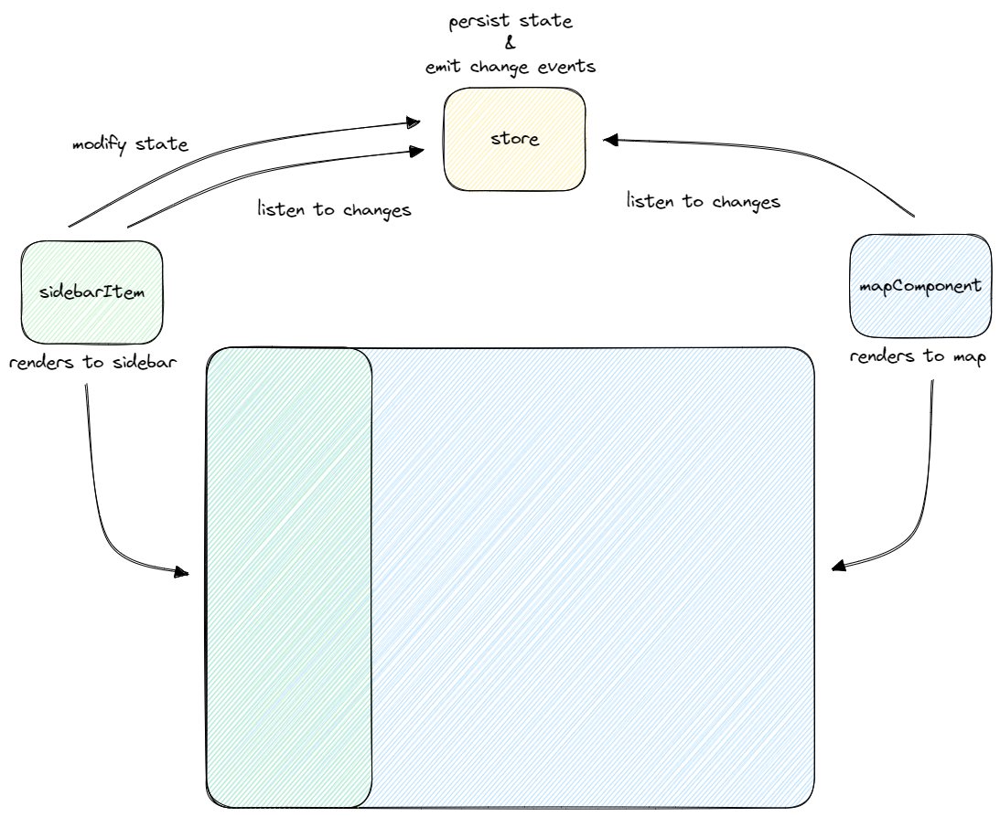
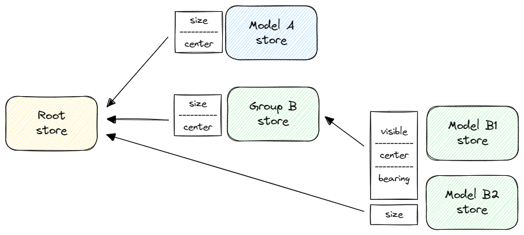

# Design

<details>
  <summary>Table of Contents</summary>
  <ol>
    <li><a href="#goals">Goals</a></li>
    <li><a href="#overview">Overview</a></li>
    <li><a href="#visualization-data-model">Visualization data model</a></li>
    <li><a href="#state-management-core">State management core</a></li>
    <li><a href="#architecture">Architecture</a></li>
    <li><a href="#code-structure">Code structure</a></li>
  </ol>
</details>

## Goals

- **Customizable:** custom visualizations should be easy to build and load from a local JSON file
- **Shareable:** visualization setups and their location should be shareable through links
- **Client-side only:** there's no need for a dedicated back-end, only calls for third-parties should be to download map tiles and to perform forward/reverse geocoding
- **Extendable**: new visualization types (different shapes and renderings) should be easy to add
- **Type-Safe**: the state management implementation should be strongly typed to avoid common bugs
- **Minimal dependencies**: there should be no unnecessary/bloated external dependencies in production

## Overview

### Why Vanilla JavaScript/TypeScript

Reasons for deciding against a frontend framework dependency (React, Angular, Vue, etc):

- **Learning**: it was a chance to implement UI + state management from scratch
- **Greater control**: having full control of the application state and how the UI is updated
- **Simplicity**: get rid of unnecessary features provided by frameworks, reducing the final bundle size

### State management implementation

It uses the **Observer** pattern, in which a `Store` allows multiple `StoreListener`s to be registered and receive events when its internal state changes.

Implemented using the [Browser API Events System](https://developer.mozilla.org/en-US/docs/Learn/JavaScript/Building_blocks/Events) and the [`MessageEvent` interface](https://developer.mozilla.org/en-US/docs/Web/API/MessageEvent).

**Pros**

- No external dependency (native browser API)
- Easy to implement
- Performant enough for the application needs

**Cons**

- Not scalable for enterprise-level applications
- Possible performance issues for large data stores
- Needs event-listener bookkeeping to avoid possible memory leaks
- Debugging events can be difficult

For **downtoearth**, the small scope of the project means these cons are not pain points, so the simplicity and effectiveness of the **Observer** approach was proven to work well.

### Choice of mapping tools

Started the implementation with [Mapbox GL](https://github.com/mapbox/mapbox-gl-js), but it's not open source and their tile back-end is not cheap to use (with apparently no cap on the free tier usage, meaning possible surprise billing).

Decided to switch to [MapTiler](https://maptiler.com/) + [Maplibre GL](https://github.com/maplibre/maplibre-gl-js). Also uses [Turf.js](https://turfjs.org/) for geospatial calculations and [maplibre-gl-geocoder](https://github.com/maplibre/maplibre-gl-geocoder) for forward/reverse geocoding.

The change from Mapbox to Maplibre GL lead to an added layer of abstraction (and, consequently, complexity), because as an intermediate step the application was modeled to be agnostic to the underlying map rendering library. The `BaseMap` abstract class was created so that a concrete implementation could be freely swapped between different map rendering libraries.

## Visualization data model

The visualization data model was created to be as simple as possible, while allowing a flexible way to define what **downtoearth** was built for: visualizations of really large-scale systems when a single (root) component is reduced to a reasonable size and plotted on the map of the Earth.

A specific visualization definition is called a `Setup`. Each interactive unit of a setup is called a `Model`, and can be either a `SingleModel` (which is rendered to the map) or a `GroupModel` (which groups one or more single models).

A `Setup` has a `title`, a `root` model, and an optional list of `Model`s.

```typescript
interface Setup {
  title: string
  root: Root
  models?: Model[]
}
```

The `root` is a type of `SingleModel`. It is special because resizing and moving it across the map propagates to all other models.

A `SingleModel` can have one or more `Features`, which currently can be either a circle or an ellipse shape. A `Feature` can have a fill, an outline, and other rendering properties.

## State management core

The base implementation for state management is located in the `src/store/core` directory and is not coupled to the application (i.e. it could be extracted to a separate package).

A `Store` abstract class defines a data store and the **Observable pattern** functionality: registering listeners and broadcasting state changes as events. The data can be queried using the `get` method, and updated using the `set` method (which broadcasts to all listeners).

The `StoreListener` abstract class is a helper for easily listening to stores by defining _observables_ (a data class for referencing a concrete store and listing events to listen from it). The `onUpdate` method is called whenever an event is triggered.

> Notice that all `Store`s are `StoreListener`s, so that you can easily create data stores that listen to changes in other data stores.

Store's data types always extend the `StoreData` interface, which has a `type` parameter for allowing type narrowing through type guards (similar to Redux `Actions`). The `matchEvent` type guard and the `eventField` function can be used in the `onUpdate` method for dealing with state changes in a type-safe way. For example:

```typescript
onUpdate(event: AnyStoreEvent) {
  if (matchEvent<RootData>(this.rootStore.id, 'root', event)) {
    switch (eventField(event)) {
      case 'size':
        console.log(`root was resized to ${event.data.size.rendered} km`)
        break
      case 'center':
        console.log(`root was moved to ${event.data.center}`)
        break
    }
  }
}
```

## Architecture

Visualizations are defined by the `Setup` schema (discussed above). From an instance of a `Setup`, the application basically build its components: the root and the (optional) list of models and/or group of models.

### Single component

The basic design for a single component is made up of a data store, a UI element (rendered to the sidebar), and a map component.



### Stores

Data stores in **downtoearth** are defined for each model in a `Setup`. All stores have these common properties:

- `center`: a `LngLat` value that defines where on the map the model features should be rendered
- `visible`: a boolean that indicates if the model should be rendered to the map or not
- `bearing`: _(optional)_ a number that indicates the bearing angle in relation to the root or to the group (only applies if the model is positioned with an offset)

#### Root store

The root store also has a `size` property. Its `real` component indicates the size of the underlying real object being modeled (e.g. the Sun or the Earth), while the `rendered` component indicates its currently rendered size on the map (in km). Together, these numbers define the `sizeRatio` for all other models: `sizeRatio = rendered / real`.

```typescript
size: {
  real: number
  rendered: number
}
```

#### Model store

The model store has a `sizeRatio` property, defined by the root size (as mentioned above).

It listens to `size` events from the root store and, if it's not part of a group, also listens to its `center` event.

If the model _is_ part of a group, it will listen to its group's store `center` event, as well as its `visible` and `bearing` events.

#### Group store

The group store has no additional properties.

It listens to the root store `size` and `center` events.

### Example

Below is an example for a simple setup.

```
Root
├─ Model A
├─ Group B
│  ├─ Model B1
│  ├─ Model B2
```



- All models listen to the `size` state changes from the root store.
- Single ungrouped models listen to the `center` event from the root.
- Grouped models listen to `visible`, `center`, and `bearing` events from its respective group store.

## Code structure

### Entry point `src/main.ts`

The project's entry point creates an `App` instance, waits for the map to be fully loaded, then renders the initial visualization `Setup`.

### App `src/app/*.ts`

Defines the main app logic, which reads a `Setup` and builds its corresponding `Root`, `Group`, and `Model` components.

Also defines factories for building these components.

### Components `src/components/**/*.ts`

The files in the `src/components/dom` directory define all DOM components that can be (re)rendered in the context of model stores and their state changes.

In the `src/components/map` directory the map components for the root and single models are defined.

### Map `src/map/*.ts`

An abstraction for a map rendering library is defined in `src/map/BaseMap.ts`.

The concrete implementation for **Maplibre GL** is in `src/map/maplibregl.ts`.

### Setup typing `src/setups/index.ts`

Defines the typing for the `Setup` schema.

### Store `src/store/**/*.ts`

Here the concrete store implementations can be found in `RootStore.ts`, `ModelStore.ts`, and `GroupStore.ts`.

The directory `src/store/core` holds the base implementation for the `Store` state management.
