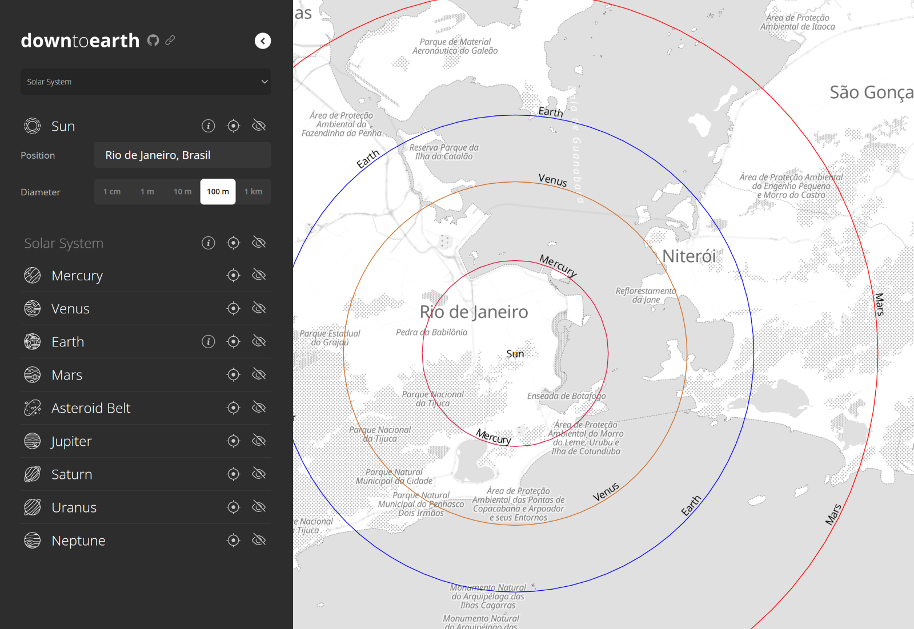

<br />
<div align="center">
  <a href="https://github.com/pedrosbmartins/downtoearth">
    <picture>
      <source media="(prefers-color-scheme: dark)" srcset="assets/logo.png">
      
    </picture>
  </a>

  <p align="center">
    Visualize astronomical scales and more by using your own geographical intuition.
    <br />
    <a href="https://pedrosbmartins.github.io/downtoearth"><strong>Start exploring »</strong></a>
    <br />
    <br />
    <a href="https://github.com/pedrosbmartins/downtoearth/issues">Report Bug</a>
    ·
    <a href="https://github.com/pedrosbmartins/downtoearth/issues">Request Feature</a>
  </p>
</div>

<details>
  <summary>Table of Contents</summary>
  <ol>
    <li><a href="#about">About</a></li>
    <li>
      <a href="#usage">Usage</a>
      <ul>
        <li><a href="#custom-visualizations">Custom visualizations</a></li>
        <li><a href="#sharing">Sharing</a></li>
      </ul>
    </li>
    <li><a href="#schema">Schema</a></li>
    <li><a href="#development">Development</a></li>
    <li><a href="#license">License</a></li>
    <li><a href="#credits">Credits</a></li>
  </ol>
</details>

## About

[](assets/screenshot-20231113.png)

> If the sun was 1 cm in diameter and stood right in my living room, how far away would the nearest star be?

> And if it was 1 m in diameter, where would Earth's orbit be?

This thought experiment can lead to interesting personal insights about astronomical scales. It's an amazing exercise to scale down the universe and map these unfathomable distances to those of your own geographical context, of which you have better intuition.

**downtoearth** is a simple interactive visualization tool built to bring these thought experiments to life and allow others to use their own geographical intuition. Created around a purpose-built JSON schema, it can be used to plot astronomical objects and their distances (or anything else of interest, really!) scaled down and overlaid anywhere on the Earth's surface.

### Objectives

The **downtoearth** project aims for simplicity.

- **Customizable**: custom visualizations can be built and loaded from a local JSON file
- **Shareable visualizations**: a URL parameter allows sharing of custom visualizations
- **Client-side only**: no back-end or API calls (other than downloading map tiles and doing reverse geocoding)
- **Minimal dependencies**: no use of full-blown JS frameworks

## Usage

To start exploring, go to the [project page](https://pedrosbmartins.github.io/downtoearth) and select one of the pre-built visualizations in the dropdown.

By default, the map is centered on a random city. If you wish, you may click the icon in the top-right corner to use your current location. Otherwise, search for a location or manually navigate the map then click anywhere to re-center the visualization.

### Custom visualizations

The **downtoearth** visualizations are built with a custom JSON schema. You can upload your own visualization as a JSON file in this schema by selecting the `From file...` option in the main dropdown.

### Sharing

To share your current visualization and location, click on the **share button** next to the logo. It will display a shareable link (and also copy it to your clipboard, if your browser supports that).

## Schema

The JSON schema can be accessed in [setup/schema.json](https://github.com/pedrosbmartins/downtoearth/blob/main/setup/schema.json). It is generated automatically from the TypeScript types defined in [src/types.ts](https://github.com/pedrosbmartins/downtoearth/blob/main/src/types.ts).

A single visualization is called a `Setup`. In a nutshell, Setups have a required `title` and `root` model (its main object for centralization and scaling), and may have multiple additional `models`.

A `model` represents an individual object that can be visualized and interacted with. Models can be positioned and sized relative to the root. They have a `label` and one or more `features`, which define shapes to be rendered on the map. Shapes have properties such as `fill` and `outline`.

Currently, the only implemented shapes are `Circles` and `Ellipses`.

### Examples

All the pre-built visualizations can be found in the `/setup` directory.

Here is a simple example for the Earth-Moon system, with Earth as the root and a model for the orbit and for the body of the Moon.

<details>

<summary>Earth-Moon Example Setup</summary>

```json
{
  "$schema": "./schema.json",
  "title": "Example",
  "root": {
    "icon": "earth",
    "label": "Earth",
    "size": 12742,
    "features": [
      {
        "shape": "circle",
        "label": { "value": "Earth", "position": "center" },
        "fill": { "color": "#6b93d6", "opacity": 0.5 },
        "outline": { "color": "#4f4cb0" }
      }
    ],
    "sizePresets": [
      { "label": "10 m", "km": 0.01 },
      { "label": "1 km", "km": 1, "default": true },
      { "label": "10 km", "km": 10 }
    ]
  },
  "models": [
    {
      "label": "Moon",
      "bearingControl": true,
      "bearing": 90,
      "models": [
        {
          "label": "Orbit",
          "size": 769496,
          "icon": "moon",
          "features": [
            {
              "shape": "circle",
              "outline": { "color": "darkgray" }
            }
          ]
        },
        {
          "label": "Body",
          "size": 3474.8,
          "icon": "moon",
          "popup": { "content": "Moon" },
          "features": [
            {
              "shape": "circle",
              "fill": { "color": "gray" },
              "outline": { "color": "darkgray" },
              "offset": 384748,
              "drawLineToRoot": true
            }
          ]
        }
      ]
    }
  ]
}
```

</details>

## Development

To begin local development:

1. `yarn install`
2. `yarn start`

The last step runs both `tsc` and `browserify` in watch mode, and also spins up a `live-server` instance on http://localhost:8080 by default.

## License

Distributed under the MIT License. See `LICENSE` for more information.

## Credits

- [Space Icon Pack](https://www.flaticon.com/packs/space-84)
