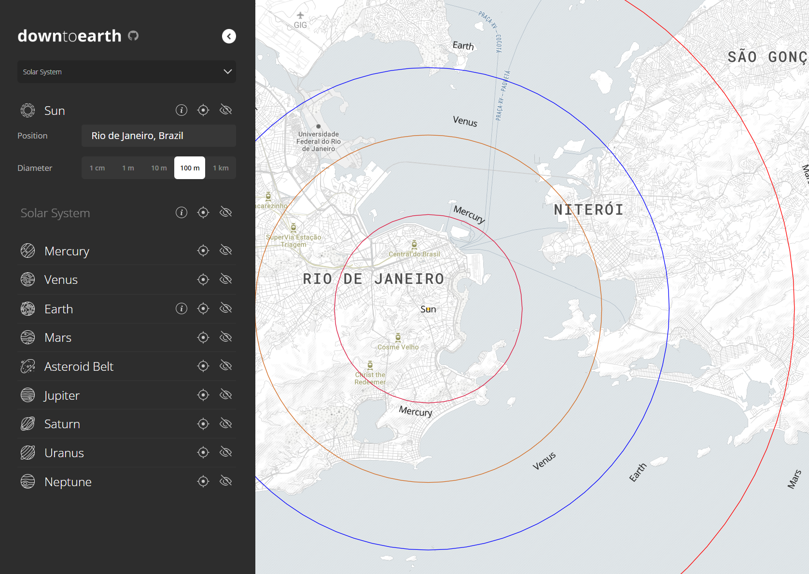

<a name="readme-top"></a>

<br />
<div align="center">
  <a href="https://github.com/pedrosbmartins/downtoearth">
    <picture>
      <source media="(prefers-color-scheme: dark)" srcset="assets/logo.png">
      
    </picture>
  </a>

  <p align="center">
    Visualize astronomical scales and more by using your own geographical intuition.
    <br />
    <a href="https://pedrosbmartins.github.io/downtoearth"><strong>Start exploring »</strong></a>
    <br />
    <br />
    <a href="https://github.com/pedrosbmartins/downtoearth/issues">Report Bug</a>
    ·
    <a href="https://github.com/pedrosbmartins/downtoearth/issues">Request Feature</a>
  </p>
</div>

<details>
  <summary>Table of Contents</summary>
  <ol>
    <li>
      <a href="#about-the-project">About</a>
    </li>
    <li>
      <a href="#getting-started">Getting Started</a>
      <ul>
        <li><a href="#prerequisites">Prerequisites</a></li>
        <li><a href="#installation">Installation</a></li>
      </ul>
    </li>
    <li><a href="#usage">Usage</a></li>
    <li><a href="#roadmap">Roadmap</a></li>
    <li><a href="#contributing">Contributing</a></li>
    <li><a href="#license">License</a></li>
    <li><a href="#contact">Contact</a></li>
    <li><a href="#acknowledgments">Acknowledgments</a></li>
  </ol>
</details>

## About

[](assets/screenshot-20231019.png)

> If the sun was 1 cm in diameter and stood right in my living room, how far away would the nearest star be?

> And if it was 1 m in diameter, where would Earth's orbit be?

This type of thought experiment can lead to interesting personal insights about astronomical scales. It's an amazing exercise to scale down the universe and map these unfathomable distances to those of your own geographical context, of which you have better intuition.

In order to bring these thought experiments to live and allow others to use their own geographical intuition, the **downtoearth** project was born.

It is a simple interactive visualization tool built around a purpose-built JSON schema, that can be used to plot astronomical objects and their distances (or anything else of interest) scaled down and overlaid anywhere on the Earth's surface.

### Objectives

The **downtoearth** project aims for simplicity.

- **Customizable**: custom visualizations can be built in a domain-specific JSON schema and then loaded from a local file
- **Shareable visualizations**: a URL parameter allows custom visualization sharing
- **Client-side only**: no back-end or API calls
- **Minimal dependencies**: no use of full-blown JS frameworks

...

- Setup typing/schema
- URL sharing

<p align="right">(<a href="#readme-top">back to top</a>)</p>

## Usage

To start exploring, simply go to the [official **downtoearth** page](https://pedrosbmartins.github.io/downtoearth) and select one of the pre-built visualizations in the dropdown.

By default, the map is centered on a random city. If you wish, you may click the icon in the top-right corner to use your current location. Otherwise, simply navigate the map manually and click anywhere to re-center the visualization.

### Custom visualizations

The **downtoearth** visualizations are built with a custom JSON schema. You can upload your own visualization as a JSON file in this schema by selecting the `From file...` option in the main dropdown.

### Sharing

[TODO]

<p align="right">(<a href="#readme-top">back to top</a>)</p>

## Schema

A single visualization is called a `Setup`. In a nutshell, Setups have a required `title` and may have a `root` model (its main object for centralization and scaling) and multiple `groups` of models.

A `model` is simply an individual object that can be visualized. It has a `label` and one or more `layers`, which define shapes with properties such as a fill and an outline.

Currently, the only implemented shapes are Circles and Ellipses.

The JSON schema is generated automatically from the TypeScript types defined in [src/types.ts](https://github.com/pedrosbmartins/downtoearth/blob/master/src/types.ts). It can be accessed in [setup/schema.json](https://github.com/pedrosbmartins/downtoearth/blob/master/setup/schema.json).

### Example

A basic example with a root and a group of two objects. The group is positioned with an offset and the objects are sized relative to the root.

<details>

<summary>Setup JSON</summary>

```json
{
  "$schema": "./schema.json",
  "title": "Example",
  "unit": { "name": "km", "km": 1 },
  "root": {
    "id": "root",
    "label": "Root",
    "visible": true,
    "layer": {
      "id": "root",
      "shape": "circle",
      "visible": true,
      "radius": { "type": "relative", "real": 1 },
      "fill": { "color": "yellow" }
    },
    "sizePresets": [
      { "label": "1 km", "km": 1, "default": true },
      { "label": "100 km", "km": 100 },
      { "label": "1000 km", "km": 1000 }
    ]
  },
  "groups": [
    {
      "id": "group",
      "label": "Group",
      "visible": true,
      "bearingControl": true,
      "bearing": 270,
      "offset": { "type": "relative", "real": 10 },
      "models": [
        {
          "id": "1",
          "label": "Object 1",
          "visible": true,
          "layers": [
            {
              "id": "1",
              "shape": "circle",
              "visible": true,
              "radius": { "type": "relative", "real": 2 },
              "fill": { "color": "red" },
              "drawLineToRoot": true
            }
          ]
        },
        {
          "id": "2",
          "label": "Object 2",
          "visible": true,
          "layers": [
            {
              "id": "2",
              "shape": "circle",
              "visible": true,
              "radius": { "type": "relative", "real": 2 },
              "fill": { "color": "blue" },
              "offset": { "type": "relative", "real": 2 },
              "drawLineToRoot": true
            }
          ]
        }
      ]
    }
  ]
}
```

</details>

<p align="right">(<a href="#readme-top">back to top</a>)</p>

## Getting Started

This is an example of how you may give instructions on setting up your project locally.
To get a local copy up and running follow these simple example steps.

### Prerequisites

This is an example of how to list things you need to use the software and how to install them.

- npm
  ```sh
  npm install npm@latest -g
  ```

### Installation

1. Get a free API Key at [https://example.com](https://example.com)
2. Clone the repo
   ```sh
   git clone https://github.com/pedrosbmartins/downtoearth.git
   ```
3. Install NPM packages
   ```sh
   npm install
   ```
4. Enter your API in `config.js`
   ```js
   const API_KEY = 'ENTER YOUR API'
   ```

<p align="right">(<a href="#readme-top">back to top</a>)</p>

## Contributing

[TODO]
Contributions are what make the open source community such an amazing place to learn, inspire, and create. Any contributions you make are **greatly appreciated**.

If you have a suggestion that would make this better, please fork the repo and create a pull request. You can also simply open an issue with the tag "enhancement".
Don't forget to give the project a star! Thanks again!

1. Fork the Project
2. Create your Feature Branch (`git checkout -b feature/AmazingFeature`)
3. Commit your Changes (`git commit -m 'Add some AmazingFeature'`)
4. Push to the Branch (`git push origin feature/AmazingFeature`)
5. Open a Pull Request

<p align="right">(<a href="#readme-top">back to top</a>)</p>

## License

[TODO]
Distributed under the MIT License. See `LICENSE.txt` for more information.

<p align="right">(<a href="#readme-top">back to top</a>)</p>

## Contact

Pedro Martins - pedrosbarbosamartins@gmail.com

<p align="right">(<a href="#readme-top">back to top</a>)</p>

## Acknowledgments

[TODO] [icons!]

- []()
- []()
- []()

<p align="right">(<a href="#readme-top">back to top</a>)</p>
